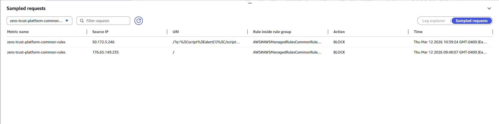
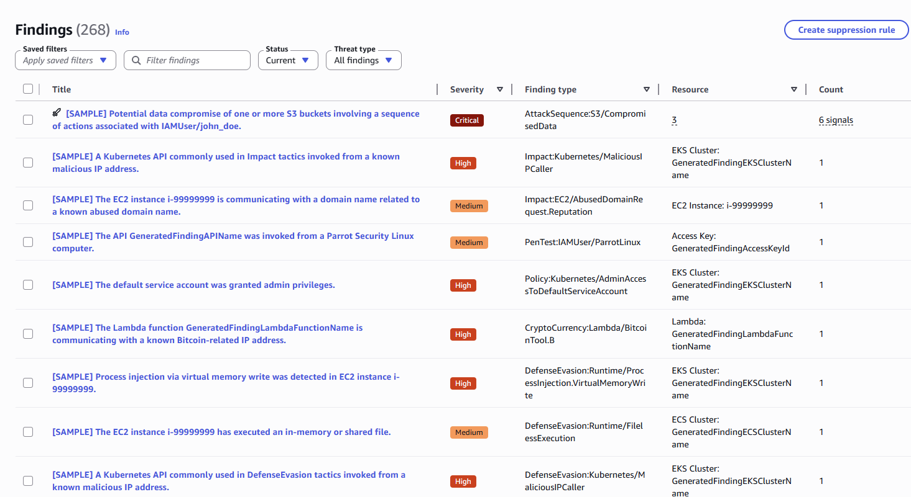
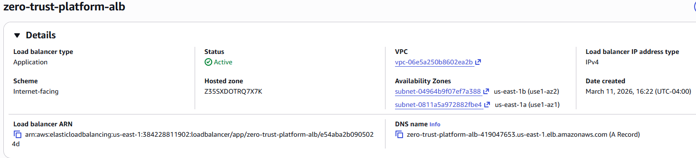
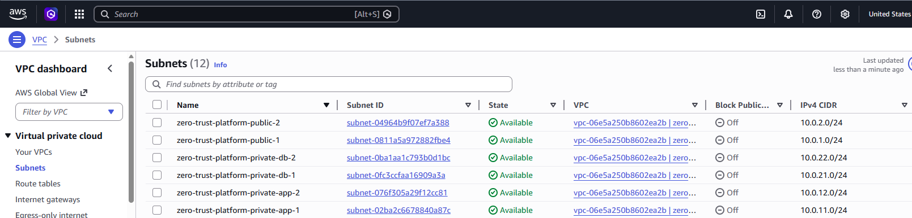
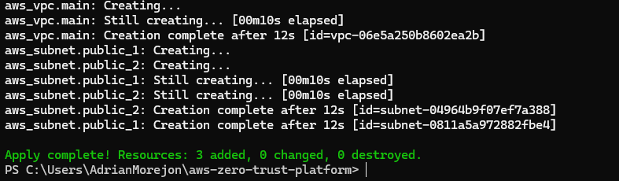

# AWS Zero Trust Security Platform (Terraform)

## Overview

This project implements a small zero-trust inspired AWS architecture designed to demonstrate how cloud infrastructure and security services can work together to detect, analyze, and respond to potential threats.

The environment was built entirely with Terraform and includes multiple layers of security controls across the network, application, and monitoring layers.

## Architecture

Internet
   
      ↓

AWS WAF   
   
      ↓

Application Load Balancer
   
      ↓

EC2 Application Tier (private subnet)
   
      ↓

Private Database Tier

Security Monitoring:
CloudTrail → GuardDuty → EventBridge → SNS Alerts

## Infrastructure Components

- Custom VPC with public and private subnets
- Application Load Balancer
- EC2 instances behind the load balancer
- Security groups enforcing least privilege access
- AWS WAF protecting the application layer
- CloudTrail logging AWS API activity
- GuardDuty threat detection
- EventBridge routing security events
- SNS alert notifications

## Security Demonstration

To validate the security controls, simulated malicious requests were sent to the application.

AWS WAF detected and blocked the attack using the AWS Managed Rules Common Rule Set.

GuardDuty generated findings which were routed through the alert pipeline.

## Infrastructure as Code

All resources were deployed using Terraform.

## Screenshots

### WAF Blocking Malicious Request

### GuardDuty Findings

### Application Load Balancer

### VPC Subnets

### Terraform Deployment

